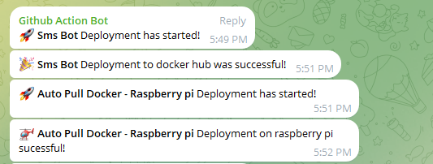

# 📱 SMS Bot - Sample NodeJs Project with simple CI-CD

[](https://github.com/dongtranthien/sms-bot/actions)


This repository manages the deployment of an SMS bot application onto a Raspberry Pi using Docker. It involves automated workflows to build, deploy, and update the Docker image, as well as a Python script for checking and updating the running container.
## 📆 Roadmap
- ✅ Basic functionality completed
- ⬜ Implement an API endpoint to fetch or update tokens dynamically.
- ⬜ Check container status on startup; if not running, start the container.

## 🚀 Workflow Overview

### 🛠️ GitHub Actions Workflow (`deploy-dockerhub.yml`)

- **Triggers**: Automatically runs on every push to the `main` branch.
- **Steps**:
  1. **Send Notification (Started)**: Notifies via Telegram that deployment has started.
  2. **Build**: Sets up Node.js, installs dependencies, builds the application, logs in to Docker Hub, and builds the Docker image for ARM64 architecture.
  3. **Send Notification (Successful)**: Sends a Telegram message if the deployment to Docker Hub was successful.
  4. **Send Notification (Failed)**: Notifies about deployment failure via Telegram.

### 🤖 Auto-Pull Docker Service (`auto-pull-docker/.service`)

- A systemd service for running a Python script (`main.py`) to continuously check and update the Docker container if a new image is available.

### 📢 Notification
<div style="text-align:center">
    
</div>

## 📁 File Structure

- `.github/workflows/deploy-dockerhub.yml`: GitHub Actions workflow for deploying to Docker Hub.
- `auto-pull-docker/.service`: systemd service file for the Python script.
- `auto-pull-docker/main.py`: Python script to check for image updates and restart the container.
- `.env.sample`: Sample environment file for configuring application-specific variables.
- `app.js`: Node.js application for managing the bot functionality.

## 🚀 Usage

1. **GitHub Actions Workflow**: Automatically builds and deploys the Docker image to Docker Hub on every push to the `main` branch.
2. **Auto-Pull Docker Service**: Runs the Python script continuously on the Raspberry Pi to check for updates and restarts the container if a new image is available.
3. **Environment Variables**: Ensure the required environment variables are set in a `.env` file based on the provided `.env.sample`.

## 🔧 Setup Instructions

1. Clone this repository onto your Raspberry Pi.
2. Modify the `.env.sample` file and save it as `.env` with the necessary environment variables.
3. Start the Auto-Pull Docker service using the provided `.service` file.

### 🛠️ Auto-Pull Docker Service Setup (on Raspberry Pi)

```bash
sudo cp auto-pull-docker/.service /etc/systemd/system/auto-pull-docker.service
sudo systemctl daemon-reload
sudo systemctl enable auto-pull-docker.service
sudo systemctl start auto-pull-docker.service
```
Note: Ensure the required permissions are set for executing the Python script.

## 🙌 Contributing
Contributions to improve this deployment setup are welcome! 

Fork the repository, make your changes, and submit a pull request.

